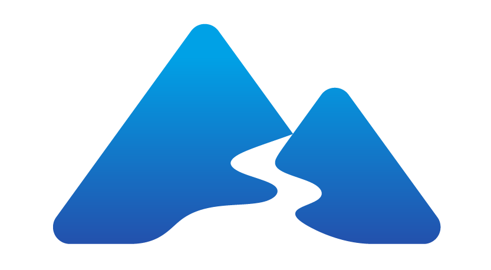

# Fjord Consumer

## What is the Fjord Consumer?

The Fjord consumer is a process that attaches to a Kafka cluster, consumes records from one or more topics, and publishes consumed data to a Redis Channel. You can use the Fjord consumer to create a Kafka consumer group with multiple Kafka consumers or a so-called _free_ Kafka consumer that operates alone. The Fjord consumer is built to be used alongside the Fjord server, which subscribes to Redis and pushes the published Kafka records to subscribed, connected clients.

## How is the Fjord Consumer Deployed?

It's possible to run the Fjord consumer locally. However, the dockerized consumer is generally intended to be deployed with the entire Fjord infrastructure on AWS, which can be done without using any code in this repo. If you'd like to deploy the entire Fjord infrastructure, please see the [deploy](https://github.com/fjord-framework/deploy) repo. If you wish to test the consumer locally, please continue reading below.

## How is the Fjord Consumer Run Locally?

### Prerequisites

#### Kafka

Before running the Fjord consumer, it's necessary to have at minimum a Kafka cluster consisting of a running ZooKeeper server and Kafka broker. This could be running locally or remotely.

If you don't have a cluster, you can clone and use Wurstmeister's `kafka-docker` [repo](https://github.com/wurstmeister/kafka-docker) or simply follow Apache Kafka's [Quickstart instructions](https://kafka.apache.org/quickstart).

#### Redis

It's also necessary to install and run Redis when running the consumer locally. To do so, you can use the official Docker [image](https://hub.docker.com/_/redis/) or follow Redis's [Quickstart instructions](https://redis.io/topics/quickstart). Make sure Redis is running prior to continuing.

#### Fjord Server

If you're running a complete local setup of all Fjord components, you should already have the Fjord server running by this point as well, so that when Redis receives new records, the server will be able to subscribe and receive them. Please see the [server](https://github.com/fjord-framework/server) repo and follow the instructions there if you have not done so already.

### Installation Steps

1. `git clone https://github.com/fjord-framework/consumer.git`
2. `cd consumer`
3. `touch .env`

In your `.env` file, specify the following variables appropriately. If your cluster doesn't implement authentication, you can omit `KAFKA_USERNAME`, `KAFKA_PASSWORD`, and `SECURITY`.

```
CLIENT=Fjord
BROKERS=localhost:9092
KAFKA_TOPICS=stocks
API_TOPICS=stocks
FROM_BEGINNINGS=false
CONCURRENT_PARTITIONS=1
CONSUMER_GROUP=stocks_group
REDIS_HOST=localhost
REDIS_PORT=6379
SECURITY=
KAFKA_USERNAME=
KAFKA_PASSWORD=
```

`localhost:9092` should work whether you're following Kafka's Quickstart instructions or using Wurstmeister's `kafka-docker` repo. If you know your broker is running on a different socket, please use that.

4. From the `consumer/` directory, enter `node source.js`. You should see something like the output below, confirming that a new consumer has joined the group.

```
>> node source.js
{"level":"INFO","timestamp":"2021-08-05T17:30:36.550Z","logger":"kafkajs","message":"[Consumer] Starting","groupId":"stocks_group"}
{"level":"INFO","timestamp":"2021-08-05T17:30:36.711Z","logger":"kafkajs","message":"[ConsumerGroup] Consumer has joined the group","groupId":"stocks_group","memberId":"Fjord-24d2cc14-e74b-4578-ab5f-7fad03528aac","leaderId":"Fjord-24d2cc14-e74b-4578-ab5f-7fad03528aac","isLeader":true,"memberAssignment":{"stocks":[0]},"groupProtocol":"RoundRobinAssigner","duration":45}
```

## Next Steps

Congratulations! Your Fjord consumer is now running locally and is attached to your Kafka cluster, ready to consume any incoming message, which it will then publish to Redis. A good next step to continue with Fjord locally is to clone the example `client` repo and open it in a browser. Please see the [client](https://github.com/fjord-framework/client) repo for further instructions.

## Docker location

https://hub.docker.com/r/fjordframework/consumer
